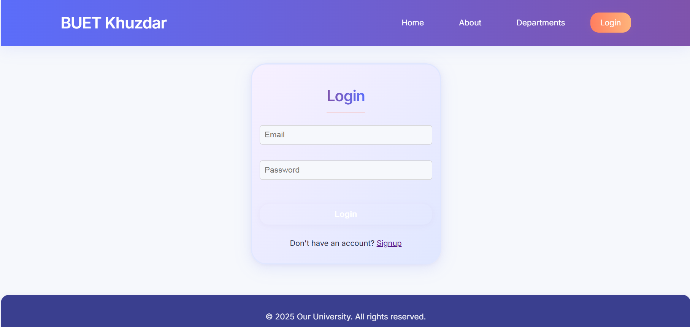
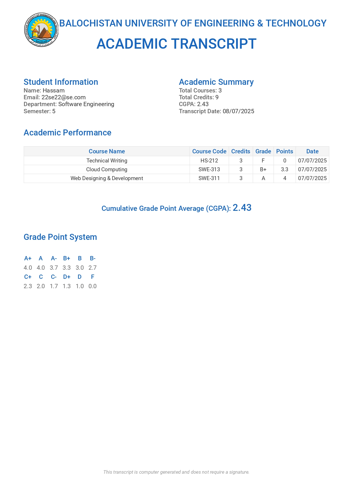
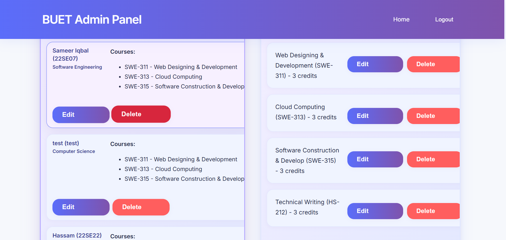

# Student Portal - Balochistan University of Engineering & Technology

A comprehensive web-based student management system for Balochistan University of Engineering & Technology (BUET) that allows students to view their academic records, register for courses, and download transcripts, while providing administrators with tools to manage students, courses, and academic results.

## 🎯 Description and Purpose

This Student Portal serves as a centralized platform for academic management at BUET Khuzdar. It provides:

- **For Students**: Profile management, course registration, grade viewing, and transcript download
- **For Administrators**: Student management, course administration, result submission, and academic oversight
- **Features**: Secure authentication, real-time data management, PDF transcript generation, and responsive design

## 🛠️ Technologies Used

### Frontend
- **HTML5** - Semantic markup and structure
- **CSS3** - Modern styling with responsive design
- **JavaScript (ES6+)** - Client-side functionality and API integration
- **PDF.js** - PDF generation for transcripts

### Backend
- **Node.js** - Server-side runtime environment
- **Express.js** - Web application framework
- **MongoDB** - NoSQL database for data storage
- **Mongoose** - MongoDB object modeling tool

### Authentication & Security
- **JWT (JSON Web Tokens)** - Secure authentication
- **bcryptjs** - Password hashing and security
- **CORS** - Cross-origin resource sharing

### Development Tools
- **Git** - Version control
- **npm** - Package management
- **nodemon** - Development server with auto-restart

---

## 🚀 Quick Start Guide

### Prerequisites

1. **Node.js** (v14 or higher)
   - Download and install from: https://nodejs.org/
2. **MongoDB**
   - Download and install from: https://www.mongodb.com/try/download/community
   - Make sure MongoDB is running (see below).
3. **Git** (optional, for cloning the repo)
   - Download and install from: https://git-scm.com/

### Project Structure

```
Student-Portal/
├── backend/           # Node.js/Express backend (API)
│   ├── models/        # MongoDB schemas
│   ├── routes/        # API endpoints
│   ├── middleware/    # Authentication & validation
│   ├── config/        # Database configuration
│   └── server.js      # Main server file
└── server/            # Frontend (HTML, CSS, JS)
    ├── assets/        # CSS, JS, and images
    ├── data/          # Sample data files
    └── *.html         # Frontend pages
```

### Installation & Setup

#### 1. Clone or Copy the Project

- If you have a zip, extract it.
- If using Git:
  ```sh
  git clone <repo-url>
  cd Student-Portal
  ```

#### 2. Install Backend Dependencies

```sh
cd backend
npm install
```

#### 3. Set Up Environment Variables

Create a `.env` file in the `backend` folder:
```env
MONGO_URI=mongodb://localhost:27017/Student-Portal
JWT_SECRET=your_jwt_secret_here
JWT_EXPIRE=7d
PORT=5001
```

#### 4. Start MongoDB

**Windows:**
```sh
"C:\Program Files\MongoDB\Server\<version>\bin\mongod.exe"
```
Or use MongoDB Compass (GUI) to start the service.

**Mac/Linux:**
```sh
mongod
```

#### 5. Start the Backend Server

```sh
cd backend
npm start
```
The backend will run on [http://localhost:5001](http://localhost:5001)

#### 6. Start the Frontend

**Option A: Direct browser access**
- Open `server/index.html` in your browser

**Option B: Static server (recommended for CORS)**
```sh
cd server
npx serve .
```
Then open the provided local URL (e.g., http://localhost:3000)

---

## 🔐 Test Credentials

### Admin Account
- **Email**: `admin@university.com`
- **Password**: `admin123`
- **Role**: Administrator

### Student Account
- **Email**: `hamza@student.com`
- **Password**: `123456`
- **Role**: Student
- **Student ID**: Available in profile
- **Department**: Computer Science

### Sample Data
The system includes sample courses and results:
- **CS101**: Introduction to Computer Science (Dr. A. Khan)
- **CS102**: Data Structures (Prof. M. Ali)

---

## 📱 Features Overview

### Student Features
- ✅ User registration and login
- ✅ Profile management and editing
- ✅ Course registration and management
- ✅ Grade viewing and transcript download
- ✅ Academic progress tracking

### Admin Features
- ✅ Student account management
- ✅ Course creation and administration
- ✅ Result submission and management
- ✅ Academic oversight and reporting
- ✅ User role management

### Technical Features
- ✅ Secure JWT authentication
- ✅ Responsive design for all devices
- ✅ Real-time data synchronization
- ✅ PDF transcript generation
- ✅ RESTful API architecture

---

## 🛠️ Troubleshooting

### Common Issues

**MongoDB connection error:**
- Make sure MongoDB is running and the URI in `.env` is correct
- Check if MongoDB service is started

**Port in use:**
- Change the `PORT` in `.env` or stop other apps using that port
- Common alternative ports: 3000, 8000, 8080

**CORS issues:**
- Use a static server for the frontend, not just double-clicking HTML files
- Ensure backend is running on the correct port

**Data not saving:**
- Check backend logs for errors
- Verify API endpoints are correct
- Ensure proper authentication tokens

### Useful Commands

```sh
# Install dependencies
npm install

# Start backend (development)
npm run dev

# Start backend (production)
npm start

# Start static server
npx serve .

# Migrate passwords (if needed)
npm run migrate-passwords
```

---

## 📸 Screenshots

### Homepage

*Figure 1: Main homepage of the Student Portal*

### Login Page

*Figure 2: User authentication page*

### Student Dashboard

*Figure 3: Student dashboard with profile, courses, and results*


### Admin Dashboard

*Figure 4: Administrative panel for managing students and courses*

### Admin Dashboard

*Figure 4: Administrative panel for managing students and courses*

### Course Management

*Figure 5: Course registration and management interface*

### Results View

*Figure 6: Academic results and transcript view*

### Mobile Responsive

*Figure 7: Responsive design on mobile devices*

---

## 🤝 Contributing

1. Fork the repository
2. Create a feature branch
3. Make your changes
4. Test thoroughly
5. Submit a pull request

---

## 📞 Need Help?

If you encounter any issues:
1. Check the error messages in your terminal and browser console
2. Review the troubleshooting section above
3. Ensure all prerequisites are properly installed
4. Verify MongoDB is running and accessible

For additional support, please check the project documentation or create an issue in the repository.

---

**Built with ❤️ for Balochistan University of Engineering & Technology** 
